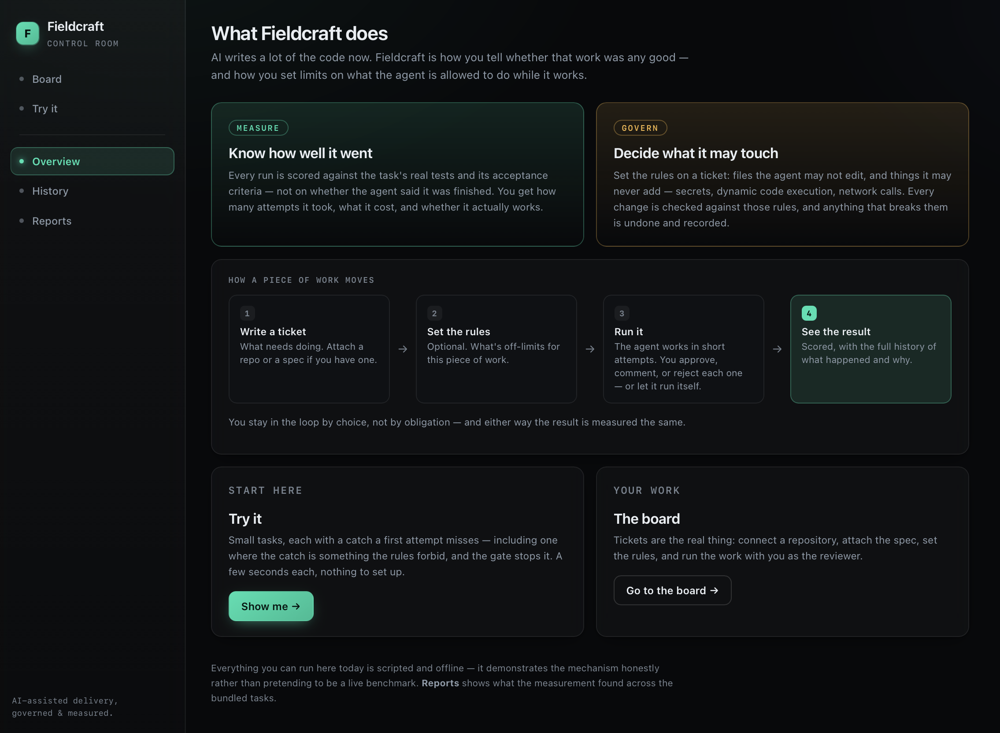
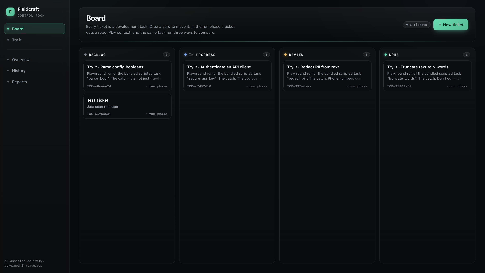
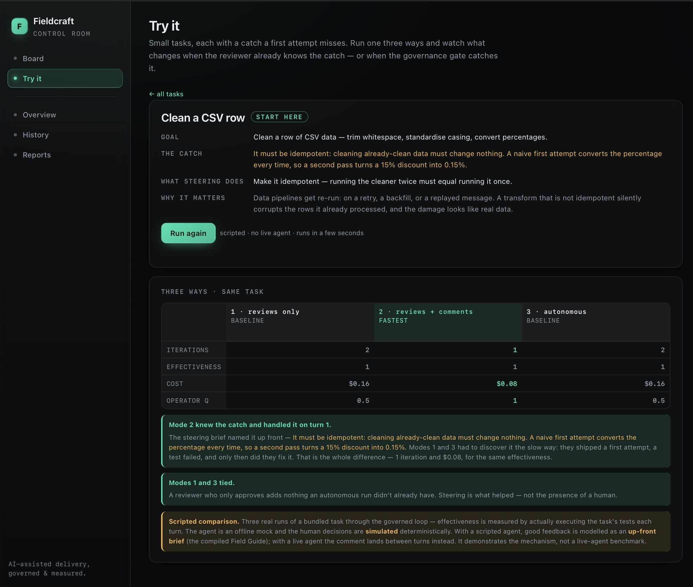
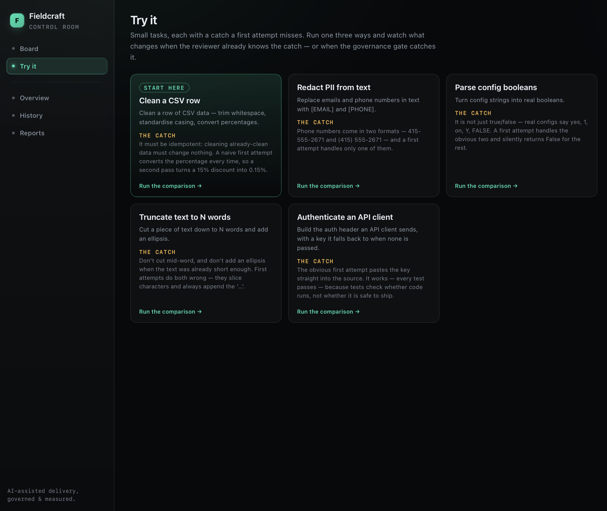
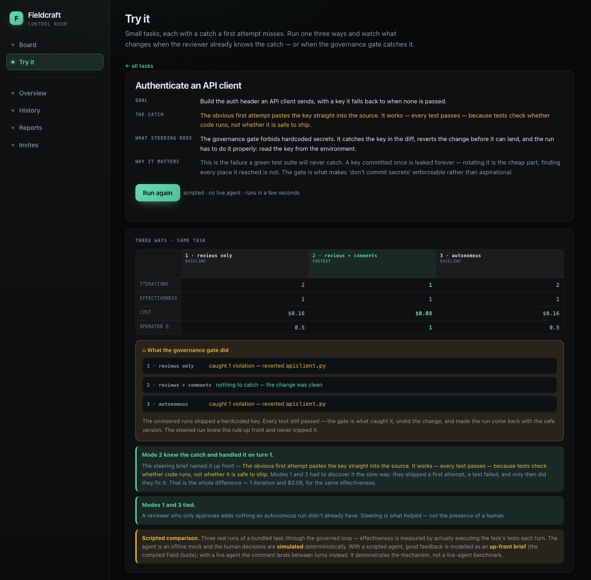
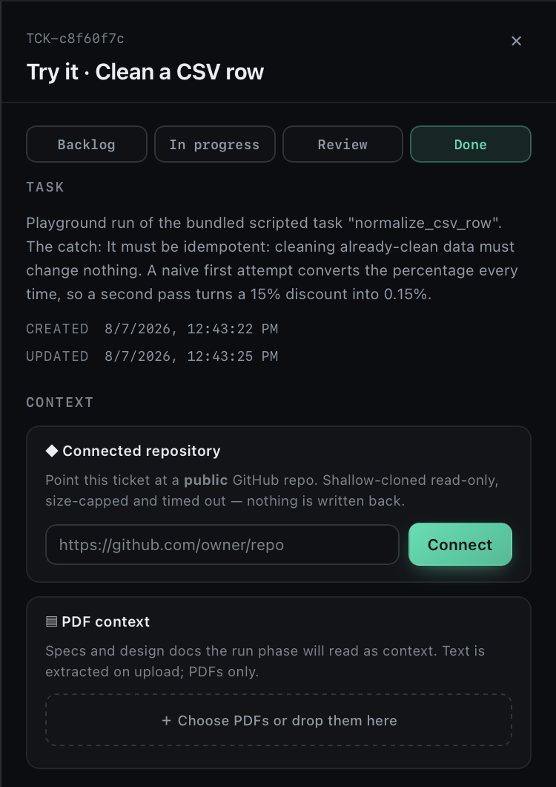
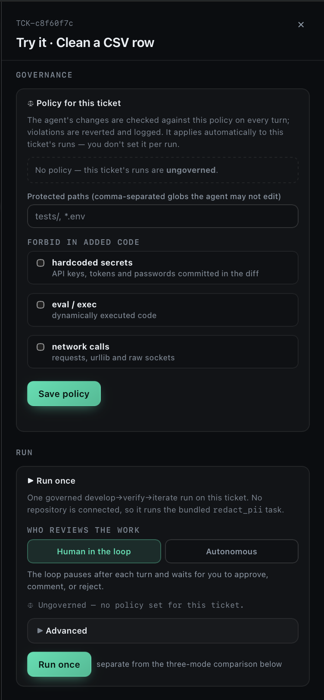
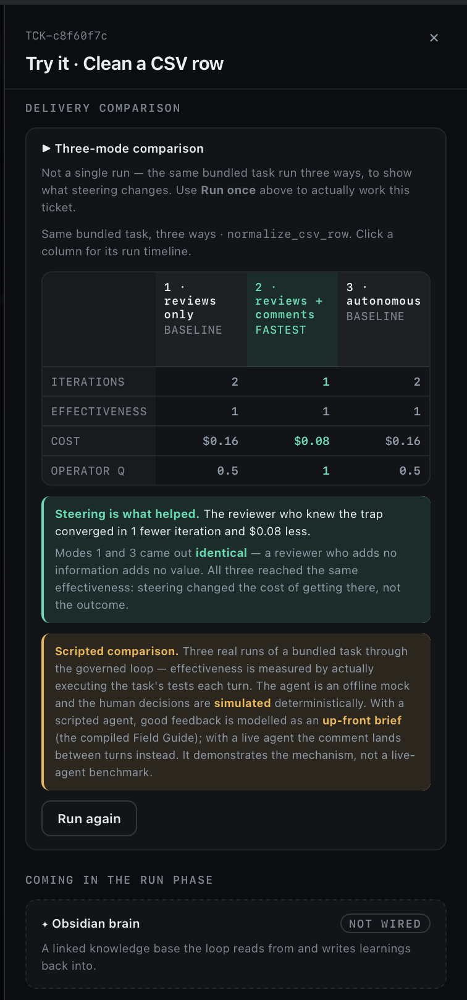

# Fieldcraft

**Measure and govern AI-assisted software delivery.**

AI made writing code fast. It didn't make *trusting* what shipped any easier. A pull request marked "done" might be solid or fragile — and from the outside they look identical. Fieldcraft runs AI coding work through a governed loop that **measures how well it was done** and **governs what the agent is allowed to do**, so "done" means something again.

🔗 **Live preview:** [fieldcraft-shreyash.fly.dev](https://fieldcraft-shreyash.fly.dev) — a working, deployed instance. Access is invite-gated (request a code from the landing page); the demo runs on curated, deterministic tasks so anyone can see the same result.

---

## The problem

When an AI agent writes the code, the old signals stop working:

- **"Done" is unreliable.** A closed ticket might be done-and-solid or done-and-fragile. The status doesn't tell you which.
- **Passing tests aren't enough.** A test suite checks whether code *runs*, not whether it's *safe* or *robust under the edge cases nobody wrote a test for*.
- **You can't see how it was built.** Was a human steering carefully, or did an agent run autonomously? That context is gone the moment the branch merges.

Fieldcraft is built around a simple idea: **the run itself is the evidence.** Every AI-assisted task runs through a develop → verify → iterate loop where each step is recorded, so the work is measurable, auditable, and governable — not a black box.

---

## What it does

### A board for AI-assisted work

Every task is a ticket. Attach a repository and context documents, set a governance policy, and run it — either as a single governed run you review turn by turn, or as a three-way comparison that shows how human involvement changes the outcome.

### It measures whether steering actually helps

This is the core demonstration. The **same task, run three ways** — a reviewer who only approves, a reviewer who gives real feedback, and a fully autonomous run — measured side by side:

The result is honest and often counterintuitive: a reviewer who just approves adds **nothing** an autonomous run didn't already have. What helped was the *quality of the steering* — the reviewer who named the catch up front converged faster and cheaper, for the same final quality. **Steering changed the cost of getting there, not the outcome.** Fieldcraft measures that difference directly.

> The comparison runs on curated, scripted tasks *by design* — that keeps the demonstration deterministic and reproducible, so you see the same clean result every time rather than the noise a live agent would introduce.

### Try it yourself — no setup

A set of small, self-explanatory tasks, each with a hidden "catch" a first attempt tends to miss. Run any of them three ways and watch what changes.

### It governs what the agent may do

Each ticket carries a policy — protected paths the agent may not touch, and forbidden patterns (hardcoded secrets, `eval`/`exec`, network calls). The agent's changes are checked against it on every turn; violations are reverted and logged. This is the "govern" half, made tangible.

One of the Try-it tasks demonstrates it: the agent's naive attempt hides a hardcoded secret that **passes every test** — and the governance gate catches and reverts what the tests couldn't:

### Everything in one place, per ticket

Connect a repo, add PDF context, set governance, run and review — all from a single ticket. Start a governed run and choose who reviews it:

Set the policy the agent's changes are checked against, per ticket:

And attach the repository and context documents the run should use:

---

## Is the measurement trustworthy?

The quality signals are only as good as the judge behind them. Fieldcraft's LLM-as-judge was calibrated against a labeled set of real runs:

- **Mean Cohen's κ = 0.886 across 5 live runs** (range 0.856–0.916)
- **94.5% agreement** over 152 forced-tool-use judgments per run
- Perfect agreement on 3 of 4 criteria, with a characterized, consistent bias on the fourth (idempotence edge cases)

These are 5 runs on one fixture set for one task — a real, measured, reproducible result, not a large study. The point is that the number is *measured and characterized*, not asserted. (Full method and raw results in [`docs/CALIBRATION.md`](docs/CALIBRATION.md).)

---

## Built to be trusted, not just to work

Fieldcraft is a live, multi-user product, and the engineering reflects that:

- **Access is gated.** Invite-only, with an operator admin view to approve and revoke access.
- **Spend is capped.** Per-user and global daily cost caps, enforced durably — every run path (single run, three-mode comparison) reserves against the same ledger, so nothing can run uncapped.
- **Execution is hardened.** Untrusted code runs credential-free (the API key is absent by construction), resource-limited, and process-isolated. The current isolation level is reported honestly at `/healthz`.
- **The metrics resist gaming.** The verification-integrity check catches weakened or deleted tests, because an accountability layer you can cheat is worthless.

Where something isn't fully built yet, the product says so — honest labels over impressive-looking fakes.

---

## The vision

The board is one lens on a larger idea: **one measurement-and-governance engine, served through many role lenses.** The same recorded runs answer different questions for different people —

- **The engineer** — accountability for robustness, security, cost discipline, and the quality of their steering.
- **The PM / scrum master** — delivery truth: trustworthy "done," quality-adjusted velocity, visible rework, where a release is fragile.
- **QA** — where to focus scarce review attention, and provenance for how each change was built.
- **Platform / Ops** — tracing a production incident back to how the AI built the thing that broke.
- **Agent access control** — brokering *just enough* access to the tools engineering uses, scoped and audited.
- **Team memory** — recommending how a similar problem was solved before, so experience compounds instead of evaporating.

See [`VISION.md`](VISION.md) for the full picture.

---

## Status

A working, deployed product with a governed run loop, a calibrated judge, per-ticket governance, a three-mode measurement comparison, a guided playground, and gated multi-user access with durable spend caps. The comparison and playground run on curated deterministic tasks; live-agent execution against arbitrary repositories is the next frontier and is deliberately gated behind per-run isolation work that isn't finished yet.

Honesty about what's real is a feature here, not a caveat.
