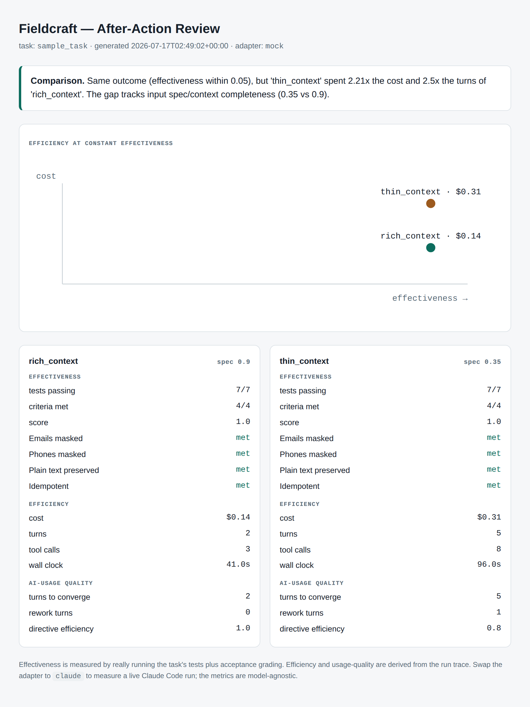

# Fieldcraft

**Measuring how effectively people deliver with AI.**

Coding agents made *building* cheap. What almost nobody measures is the *delivery*: when an engineer works a task with an AI agent, did they ship faster, cheaper, and better — and where is the improvable gap? Agent-reliability tooling grades the *agent*. Fieldcraft grades the *human + AI loop*.

This repo is two things, in order of importance:

- **A working v0 (`fieldcraft_aar/`)** — a small, runnable harness that instruments an AI-assisted coding task and emits an After-Action Review: effectiveness, efficiency, and how well the operator drove the agent.
- **A design exploration (`docs/architecture.md`)** — the larger system this measurement layer belongs to.

---

## Run it — 30 seconds, no credentials

```bash
pip install -r requirements.txt
python -m fieldcraft_aar --adapter mock
# → out/aar.json and a self-contained out/aar_report.html
```



The demo runs the same task two ways — a rich-context run and a thin-context run. Both reach **identical effectiveness** (all tests pass, all acceptance criteria met), but one costs **2.2× the other**, with the gap attributed to input context quality. That delta is invisible to agent-reliability scoring, and it is the whole point.

Effectiveness is **real** — the harness actually runs the task's `pytest` suite and probes the resulting code against each acceptance criterion. Only the run *trace* (cost/turns) is replayed in mock mode.

---

## What it measures

| Family | Answers | Signals |
|---|---|---|
| **Effectiveness** | Was the outcome good? | tests passing, acceptance criteria met, composite score |
| **Efficiency** | What did it cost? | cost (USD), turns, tool calls, wall-clock |
| **AI-usage quality** | How well did the operator drive the AI? | turns-to-converge, rework turns, directive efficiency, input spec completeness |

Efficiency is compared **only at constant effectiveness** — "used less" counts as better *only when the outcome is held equal*, never for cutting corners.

---

## Is the judge trustworthy? — measured

Open-ended acceptance criteria are graded by a Claude **forced tool-use** judge, so
the obvious question is whether that judge agrees with a human. Calibrated against
38 hand-labeled fixtures:

> **Mean Cohen's kappa 0.886 across 5 live runs** (range 0.856–0.916, SD 0.022),
> **94.5% agreement over 152 forced-tool-use judgments** per run. Perfect agreement
> on 3 of 4 criteria, with a **characterized conservative bias on AC4**
> (idempotence edge cases).

Every one of the 42 disagreements across 760 judgments was the same direction — the
judge saying `unmet` where the label said `met`. There were no false `met` verdicts,
so the judge under-reports effectiveness rather than inflating it.

Scope, stated plainly: **5 runs on one fixture set for one task — not a large
study**, and the fixtures are committed rather than held out, so they can be tuned
against. Raw per-run numbers, method, and limits: [`docs/CALIBRATION.md`](docs/CALIBRATION.md).

```bash
python -m fieldcraft_aar.calibration --grader tooluse   # reproduce (needs ANTHROPIC_API_KEY)
python -m fieldcraft_aar.calibration                    # offline, deterministic grader
```

---

## Live mode

```bash
python -m fieldcraft_aar --adapter claude --grader claude --conditions rich_context
```

Runs a real Claude Code session (`claude -p --output-format json`) in a fresh workdir and parses its cost/turns. The `RunAdapter` seam is the design: the metrics are **model- and framework-agnostic** — point it at any agent that edits a repo, and the measurement layer doesn't care which model produced the work.

---

## Layout

```
fieldcraft_aar/      the harness: adapters · effectiveness · telemetry · aar · report
sample_task/         a small PII-redaction task (stub, tests, criteria, reference solution)
sample_task/fixtures 38 hand-labeled candidates the judge is calibrated against
scenarios/           recorded run traces for offline mock mode
docs/architecture.md the broader design this slice belongs to
docs/CALIBRATION.md  measured judge calibration — raw five-run results and method
```

---

## The bigger picture

This harness is one layer of a larger design for AI-assisted forward-deployed engineering — trust boundary, execution model, verification, governance, and this measurement layer. That design lives in [`docs/architecture.md`](docs/architecture.md), written as an exploration.

To be clear about status: **the measurement slice in this repo runs; the full architecture is a design, not a shipped system.** The interesting, differentiated, and *built* part is the measurement of human + AI delivery.

---

## Status & limits

- **v0.** The mock scenarios are illustrative traces; live mode produces real numbers.
- **Fair cross-operator comparison needs N.** Difficulty-adjusting real, different tasks to isolate operator skill improves with data — it is a direction, not a solved ranking engine. Standardized benchmark tasks (like the sample) give clean apples-to-apples soonest.
- Effectiveness rests on test quality — passing tests narrow the correctness gap, they don't close it.
- **The judge is calibrated, not solved.** kappa 0.886 ± 0.022 is five runs over one committed fixture set; a held-out set, an ensemble, and cross-task calibration are outstanding ([HARDENING P1-3](HARDENING.md)). Re-run calibration after any model, prompt, or criteria change — the number does not transfer.

## License

MIT — see [LICENSE](LICENSE).
