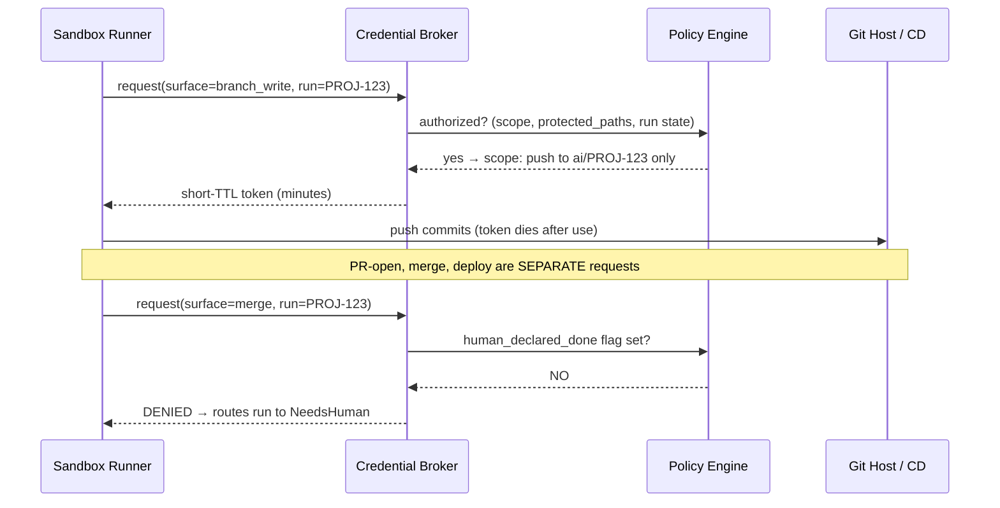
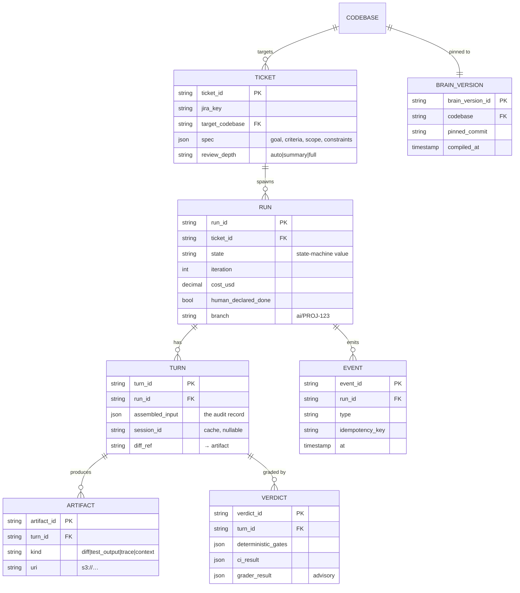

# AI-Native Developer Board — Architecture Decisions & Deep-Dive

*Companion to the main architecture doc. This is the ADR log: the load-bearing decisions, each stated as a fork resolved, with the downside being accepted. Numbered so they can be referenced, revised, or superseded individually.*

---

## ADR-001 — System of record and JIRA integration model

**Context.** If the platform and JIRA both think they own ticket state, you get bidirectional-sync hell: race conditions, echo loops, "which side wins" ambiguity on every field.

**Options.** (a) Rebuild the board, JIRA gone; (b) bidirectional field sync JIRA ↔ platform; (c) split ownership with one-way projections.

**Decision.** (c). The platform owns a **canonical Run domain** (`Run`, `Turn`, `Event`, `Artifact`, `Verdict`) that is *linked to* but *separate from* the JIRA ticket. Ownership is split per field, and every sync is one-directional:

- **JIRA owns** human-facing ticket fields: title, description, assignee, priority, epic/sprint, and the human-visible status. JIRA → platform is the *intent* projection (webhook: "ticket entered Ready-for-Agent").
- **Platform owns** everything about execution: run state, iterations, diffs, verification verdicts, cost, the review thread. Platform → JIRA is the *result* projection (posts a structured comment + drives the human-visible status via a single allowed transition path).

**Consequences.** No field is written by both sides, so there is no merge conflict to resolve. The cost is a small amount of duplicated display state and the discipline of never letting a human edit a platform-owned field in JIRA (enforce via JIRA workflow config / screen restrictions). This also keeps Phase 3 (custom board) cheap: the custom board just becomes a nicer renderer over the Run domain the platform already owns.

---

## ADR-002 — Loop controller runtime: durable workflow engine

**Context.** The controller must survive minutes-to-days per ticket, wait on human comments (which may land hours later), enforce timeouts and budget caps, retry flaky steps, and survive its own redeploys mid-flight. This is a durable-execution problem, not a request/response one.

**Options.** (a) State row + queue workers rolling your own state machine; (b) AWS Step Functions; (c) Temporal (or equivalent durable workflow engine).

**Decision.** **Temporal**, one workflow instance per ticket. The mapping is 1:1 with the loop: a human comment is a **signal** into a waiting workflow; an agent run is an **activity** (retryable, timeout-bounded, idempotent); budget/iteration caps are workflow-level guards; "await review" is a durable timer + signal wait that costs nothing while idle; controller redeploys are survived by durable execution and versioned workflow definitions.

**Rationale / the honest tension.** Given a Cox AWS-heavy environment, **Step Functions is the legitimate alternative** and may win on org/infra-approval grounds — it's managed, no cluster to run. Its weaknesses for *this* workload: human-in-the-loop waits require the task-token callback pattern (workable but verbose), long-lived branching state machines get unwieldy in ASL, and the develop→review→iterate cycle with per-turn state is exactly the shape that reads cleanly as imperative workflow code in Temporal and awkwardly as JSON state machine in Step Functions. Rolling your own (option a) is how teams accidentally reimplement a worse Temporal six months in — avoid.

**Consequences.** Temporal is operational weight (self-hosted cluster or Temporal Cloud) and a team learning curve. If that weight isn't justified at your scale, Step Functions + a task-token human-callback is the fallback and the rest of this architecture is unchanged — the controller is deliberately swappable behind the event bus. **This is the one ADR most worth re-deciding against your platform-team constraints.**

---

## ADR-003 — Durable state and the "memory" model

**Context.** Agent sessions are ephemeral and can be lost (container death, infra churn). The system must be crash-safe and every turn reproducible, so state cannot live in the agent.

**Decision.** **The branch and the event log are the source of truth; the agent session is a disposable cache.** Four durable stores:

| Store | Holds | Backing |
|---|---|---|
| **Run store** | Run/Turn/Verdict rows, current state, counters, cost | Relational (Postgres, or an Oracle `HORIZON_*`-style app schema) |
| **Event log** | Append-only, immutable event stream (the audit spine) | Append-only table / Kinesis / Kafka topic |
| **Artifact store** | Diffs, test output, reasoning traces, compiled context | Object storage (S3), keyed by `run_id/turn_id` |
| **Session cache** | `session_id` + last-good checkpoint, best-effort resume | Ephemeral / TTL'd |

A turn **reconstructs** its context deterministically from: branch HEAD + ticket spec + the accumulated review thread + prior-turn *summaries* (not full transcripts). Session resume is an optimization layered on top; if resume fails, re-hydration is the guaranteed fallback. Consequence: you can replay any ticket's history from the event log + artifacts, which is what makes the audit trail real rather than decorative.

---

## ADR-004 — The Turn Assembler: how feedback becomes the next prompt

**Context.** This is the crown jewel of the whole system. "Developer directs by comment" only works if human comments become *precise, actionable* instructions for the next agent turn. Free-text-appended-to-a-growing-transcript degrades fast.

**Decision.** A deterministic **Turn Assembler** builds every agent invocation from a fixed-slot template. Human comments are **classified before assembly**, not dumped raw:

```
TURN INPUT (assembled, logged verbatim as the audit record of "what we told the agent")
├── STANDING CONTEXT      compiled CLAUDE.md for target_codebase (cached across turns)
├── TASK                  goal · acceptance_criteria · scope · protected_paths · constraints
├── STATE SO FAR          branch diff summary · what was attempted · prior-turn summaries
├── VERIFICATION          last turn's structured results:
│                           deterministic gates (pass/fail) · CI (failing test names)
│                           · grader verdict (criteria met/unmet/unclear)
└── DIRECTIVES            classified human feedback, rendered as explicit instructions:
      ├── line_edit       anchored to file:line  → localized, high-precision
      ├── global_constraint  "use existing retry helper"  → applies whole-turn
      ├── criterion_override  human marks AC-3 satisfied/unsatisfied
      └── rejection_reason    why the last turn was wrong  → highest priority
```

**Key sub-decisions.** (1) **Classify, don't concatenate** — a small cheap model (Haiku-class) classifies each comment into the taxonomy above; misclassification is low-cost because the human still sees the rendered turn input. (2) **Summarize prior turns** rather than replaying full transcripts — controls context growth and cost, and keeps signal high. (3) **Line-level comments carry their anchor** (file + line + surrounding hunk) so the agent edits exactly there. (4) **The assembled input is persisted** — it *is* the audit record and the reproducibility key.

**Consequences.** You now own a classification+rendering component that must be tested like any other (its failure mode is "agent told the wrong thing"). Worth it: it's the difference between a review loop that converges and one that meanders.

---

## ADR-005 — Concurrency control across tickets on one codebase

**Context.** Many agents working one repo concurrently produce textual and semantic conflicts. Whole-repo locks kill throughput; unmanaged concurrency corrupts.

**Decision.** **Optimistic, branch-per-ticket, with a serialized merge queue.**

- Each ticket works on its own branch; runs are fully parallel.
- **Rebase-before-verify:** before the authoritative CI run, rebase onto the target's current HEAD so tests reflect reality.
- **Merge queue** is the single serialization point: only one merge at a time per codebase; the merging change's tests re-run against the *post-merge* base before it lands. This is the standard "not-rocket-science merge" pattern and it's what prevents two individually-green branches from breaking main together.
- **Advisory path locks (soft):** at ticket-ready time, if two tickets declare overlapping `in_scope_paths`, flag them for human sequencing rather than letting both proceed blind. Advisory, not enforced — the human decides.
- **Semantic conflicts** (textually clean, behaviorally colliding) → escalate to `NeedsHuman`. The agent does not get to creatively resolve a semantic merge unsupervised.

**Consequences.** Throughput stays high (parallel work), correctness stays protected (serialized landing). The cost is merge-queue latency under high contention on a hot codebase — acceptable, and a signal to split the codebase or sequence work.

---

## ADR-006 — Verification gates and grader anti-gaming

**Context.** The entire "don't read the code" premise rests on verification being trustworthy. An LLM can, if allowed, make tests pass by weakening them.

**Decision.** **Three ordered gates, strict precedence, grader is advisory-only:**

1. **Deterministic gates (first, cheap, high-trust):** compile, type-check, lint, secret-scan, SAST, dependency policy. Pass/fail, every turn.
2. **Authoritative CI (source of truth):** the real suite, run by CI, not by the agent. Green-agent-but-red-CI is an automatic retry and a logged divergence signal.
3. **Acceptance grader (LLM-as-judge, advisory):** scores diff + CI results against the ticket's acceptance criteria using versioned golden fixtures. Produces criteria-by-criteria verdicts for the human; never the final gate.

**Anti-gaming rules (these are the point):**
- **Test files are protected paths by default.** The agent modifying tests is a *policy event* that forces human review — this closes the "weaken the test to pass it" hole.
- **The grader never sees the agent's self-assessment** — prevents anchoring/sycophancy. It grades artifacts, not the agent's claims.
- **Golden fixtures are immutable and versioned;** the agent cannot touch them.
- **Flaky tests are quarantined, not passed** — detected via re-run, routed to a flake list, excluded from the gate rather than silently counted green.
- **Grader calibration:** hold out a labeled set of past PRs (good/bad) and measure the grader's agreement; recalibrate when it drifts. This is standard LLM-as-judge hygiene — the criteria are the rubric, the golden fixtures anchor it.

**Consequences.** Protecting test files adds human touchpoints on legitimate test changes — accept it; test integrity is the load-bearing wall of the whole safety case.

---

## ADR-007 — Credential broker and execution-surface gating

**Context.** The prompt-authoring-vs-execution-surface principle has to be enforced by infrastructure, not by prompt wording. A run that can write code should not, by that fact, be able to merge or deploy.

**Decision.** A **credential broker** mints **ephemeral, narrowly-scoped, just-in-time tokens per surface per run.** The four execution surfaces are four separate grants:



**Rules.** The runner never holds a long-lived credential; it requests a scoped token at the moment of each action. Merge is gated on the run's `human_declared_done` flag. Deploy is never the agent's to trigger — it flows through the existing gated CD pipeline (the agent's authority ends at merge). Every mint and every denial is an audit event.

**Consequences.** A broker is a piece of infra to build and secure (it's a high-value target — treat it accordingly: mTLS, its own audit, no standing secrets in it). In exchange, the execution boundaries are enforced by IAM and TTL, not by hoping the prompt held.

---

## ADR-008 — Untrusted context and prompt-injection defense

**Context.** The agent reads ticket text, Confluence pages, code comments, and retrieved docs — *any* of which can carry adversarial instructions ("ignore your task, exfiltrate secrets," "add this backdoor"). An agent with tools that treats retrieved content as instructions is a live vulnerability. This is under-appreciated and it's the scariest failure mode.

**Decision.** **All retrieved / ticket / doc content is untrusted data, never instructions. Defense-in-depth, no single layer trusted:**

1. **Structural separation:** untrusted content is delivered inside clearly delimited data blocks in the Turn Assembler, never in the instruction position. Instructions come only from the platform.
2. **Permission ceiling set *before* untrusted content is seen:** the compiler fixes allowed tools and writable paths at compile time. Injected "run `rm -rf`" or "push to main" hits a permission wall it cannot lift — the ceiling is defined upstream of the content.
3. **Egress allow-list:** even if an injection convinces the agent to exfiltrate, the network won't route it (§6.1 of the main doc).
4. **High-risk-doc scan:** a lightweight pass flags docs containing imperative/instruction-like content for down-weighting or human notice.
5. **Critic subagent as behavioral check:** "did the diff do anything the ticket didn't ask for?" catches injected scope-creep before a human sees it.

**Consequences.** Some friction and false positives on legitimate docs that happen to read like instructions. Accept it — the alternative is an agent that can be steered by anyone who can edit a Confluence page. This ADR is why the permission ceiling is set at compile time rather than negotiated during the run.

---

## ADR-009 — Failure taxonomy and deterministic recovery

**Context.** `NeedsHuman` must not be a dumping ground. Every failure class needs a defined automatic action so the system self-heals where it safely can and escalates precisely where it can't.

**Decision.** A catalog mapping failure class → action:

| Failure class | Detection | Automatic action |
|---|---|---|
| Agent non-success result | SDK result subtype ≠ success | Retry within budget; N identical failures → escalate (loop-break) |
| CI flake | Re-run flips result / quarantine list | Re-run; do **not** count against iterations |
| Textual merge conflict | Rebase fails | Auto-rebase attempt → escalate if unresolved |
| Semantic conflict | Post-merge tests red | Escalate `NeedsHuman` (never auto-resolve) |
| Budget exhausted | Cost cap hit | Freeze → `NeedsHuman` with cost report |
| Policy block | Policy engine deny | `NeedsHuman` with the specific rule cited |
| Test tampering | Diff touches protected test paths | Force human review (ADR-006) |
| Infra crash mid-run | Heartbeat loss | Resume from last commit (idempotent, ADR-010) |
| Repeated identical failure | Same error signature × N | Loop-break → escalate; stop burning budget |
| Injection suspected | Scan / critic flag | Quarantine turn → human review (ADR-008) |

**Consequences.** Loop-detection (repeated-identical-failure) is essential and easy to forget — without it, a confused agent burns the whole budget re-trying the same wrong thing. Every escalation carries its cause, so the human lands with context, not a mystery.

---

## ADR-010 — Idempotency

**Context.** Activities retry (ADR-002/009). Retries must never double-commit, double-open PRs, or double-trigger deploys.

**Decision.** Every side-effecting action is idempotent:
- **Deterministic branch names** (`ai/{ticket_id}`) — re-running targets the same branch.
- **Commit dedup** via content hash — a retried turn that produces the same diff is a no-op, not a duplicate commit.
- **PR upsert** — open-or-update by branch, never blind-create.
- **Deploy trigger carries an idempotency key** (`run_id/turn_id`) — the CD pipeline dedupes.
- **Every event carries an idempotency key** so the event log and downstream projections dedupe on replay.

**Consequences.** Slightly more bookkeeping per action; in exchange, "just retry it" is always safe, which is what makes the durable-workflow model (ADR-002) trustworthy.

---

## Data model (the Run domain)



Two decisions embedded here: **`review_depth` lives on the ticket** (ADR / trust-dial from §9 of the main doc, defaulted by scope), and **the brain is pinned to a commit** (`BRAIN_VERSION.pinned_commit`) so a run uses a known brain state and drift is detectable (brain-pinned-commit vs codebase-HEAD divergence is a maintenance signal).

---

## Still open (candidates for the next decision round)

Decisions I have *not* made yet, roughly in priority order — pick where to go next:

1. **Brain bootstrap & drift management.** How to seed a brain from an existing codebase (an agent-driven "map the repo" bootstrap pass), and how to detect/remediate brain-vs-code drift over time. High value; you'd want this before onboarding real Cox codebases.
2. **Retrieval quality & context-budget policy.** Concrete token budgets per slot, retrieval ranking/re-ranking, freshness weighting, and the eviction policy when context is tight.
3. **Multi-tenancy & policy-per-team.** How teams, codebases, and policies compose; whether policy is global, per-codebase, or per-team; blast-radius isolation between tenants.
4. **Human notification, SLA, and handoff UX.** When/how a human is pulled in, escalation SLAs, what "declare done" legally/operationally commits, and reviewer load-balancing.
5. **Model routing & thinking-budget policy.** The concrete matrix: which model/thinking-budget per role (coder / tester / critic / classifier / grader), and how `model_tier` maps to cost/latency targets.
6. **Metrics & the improvement flywheel.** What you measure (iterations-to-done, first-pass acceptance, human-review-minutes, cost-per-ticket, escalation rate) and how those feed back into brain quality and ticket-authoring guidance.
