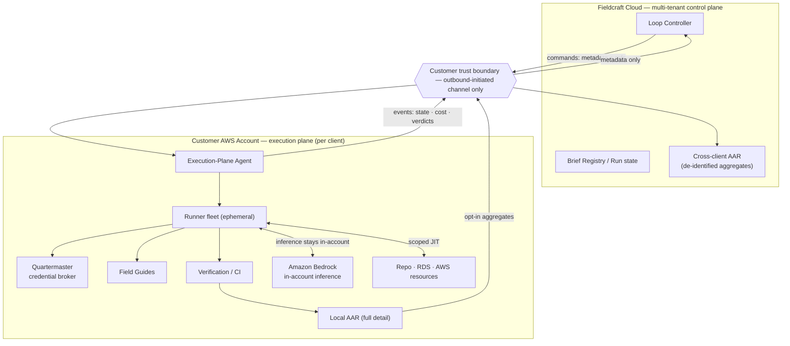
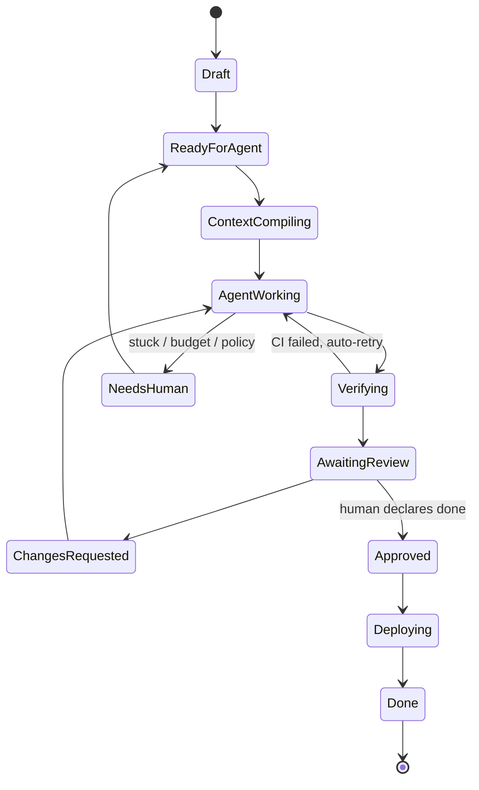
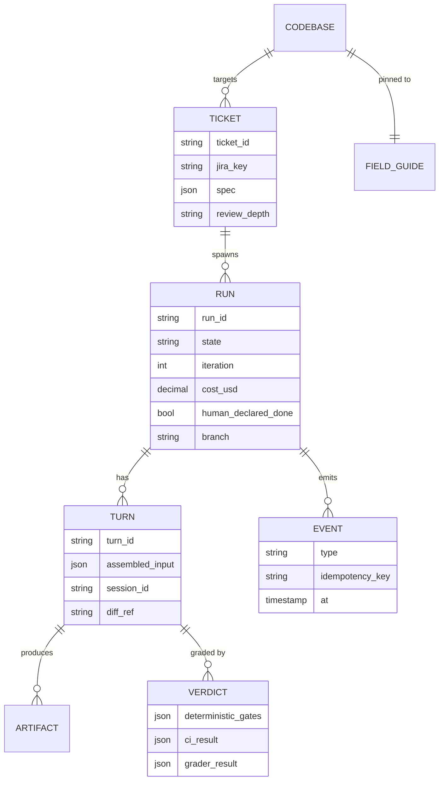

# Fieldcraft — Architecture & Design Notes

> A design exploration, not a shipped system. The working, runnable slice — the After-Action Review harness that measures how effectively a human + AI loop delivers — lives at the repo root. Start with the main [README](../README.md); this document is the deeper design the harness is one layer of.

`v1.0 · 2026`

**A measurement and orchestration layer for AI-assisted forward-deployed engineering.** One engineer directs coding agents to build, test, validate, and ship — inside the customer's environment — with the work instrumented so its effectiveness and efficiency are measurable rather than asserted.

---

## Contents

**Problem framing** — §1 Executive summary · §2 The deployment wall · §3 The solution · §4 Why now

**Architecture** — §5 System overview · §6 Topology & trust boundary · §7 Control plane · §8 Context — the Field Guide · §5 Agent execution · §6 Verification · §7 Human-in-the-loop · §8 Security & governance · §9 Data model · §10 Measurement — AAR · §11 Reliability engineering · §12 End-to-end workflow · §13 Delivery roadmap · §14 Risks & limitations · Appendix — Decision index (ADRs)

---

## §1 · Executive summary

Fieldcraft is an orchestration, trust, and measurement platform that lets a single forward-deployed engineer (FDE) operate at the throughput of a team — directing coding agents to build, test, validate, and ship inside a customer's own environment — while instrumenting the work so its efficiency and effectiveness are provable.

The premise is a shift the industry has already priced in: in enterprise AI, the scarce input is no longer the model, it is deployment — getting a capable system to work inside a customer's messy, regulated, credential-guarded environment. The role that unlocks it, the FDE, is expensive, scarce, and fundamentally does not scale: one engineer, one customer, sixty-to-a-hundred-eighty days at a time. Fieldcraft attacks exactly that constraint.

It does two things a code assistant does not. It **enables** — the FDE directs agents through a governed build-review-ship loop that runs inside the customer's trust boundary, so their code, data, and credentials never leave. And it **evaluates** — a measurement layer (After-Action Review) captures cost, cycle time, outcome quality, and how skillfully the human drove the AI, turning "the delivery went well" from an assertion into evidence.

> **The core insight.** Coding agents made building cheap. The remaining hard problems of forward-deployed work are *trust* (operating safely in someone else's account) and *proof* (showing the outcome was worth it). Fieldcraft productizes both — which is why it's a platform, not a prompt.

*Status: this document specifies the architecture and the plan. It is a design blueprint, not a claim of shipped traction.*

## §2 · The deployment wall

The dominant failure mode of enterprise AI is not model quality. An MIT study widely cited through 2026 found that roughly 95% of enterprise AI pilots produce no measurable P&L impact — and that the failures trace overwhelmingly to **deployment, not models**. A demo in a sandbox is perhaps a fifth of the job; the rest is legacy SQL, SSO/SAML, data-residency rules, and the politics of getting production credentials out of a customer's security team. Practitioners have a name for it: the integration wall.

The industry's answer is the Forward Deployed Engineer — an engineer with customer judgment who embeds in the customer's environment and ships working code, not slides. The scramble to staff the role is unambiguous:

> **Market signal — the FDE gold rush.** FDE job postings rose roughly 800% across 2025 and kept climbing into 2026, spanning 100+ companies. In May 2026, OpenAI launched a dedicated Deployment Company (backed by $4B+, acquiring an applied-AI firm and ~150 FDEs) and Anthropic announced a ~$1.5B forward-deployment joint venture with Blackstone and Goldman Sachs. Palantir — which invented the model — posted 85% revenue growth and 133% U.S. commercial growth in Q1 2026. Senior FDE comp runs $300K–$600K+.
> *Sources: JBC role tracking; MIT NANDA pilot study; OpenAI / Anthropic / Palantir announcements & results, 2026.*

But the very thing that makes FDEs valuable makes them a bottleneck. They are scarce and expensive, they embed with one customer at a time for months, and their throughput is capped by a single human doing the integration work by hand. Every AI company selling to enterprises is now bottlenecked on the same non-scalable input. **That gap — high-value work that cannot be scaled by hiring alone — is the opening.**

## §3 · The solution

Fieldcraft makes one FDE deliver like a team, safely, and proves it — by wrapping coding agents in the three things forward-deployed work actually requires that a code assistant ignores: a trust boundary, a governed human-in-the-loop loop, and measurement.

**Enable — the governed loop.** An FDE authors a *Brief* (goal, acceptance criteria, scope, protected paths, references). A coding agent picks it up, works on a branch, writes and runs tests, and posts a diff plus results. The FDE reviews and comments; those comments become precise next-turn instructions; the loop repeats until the FDE declares it done. The human stays the accountable engineer and moves at team throughput — directing, not typing. Crucially, this runs *inside the customer's environment*, so it clears the integration wall instead of pretending it isn't there.

**Evaluate — After-Action Review.** Because every state transition, cost, verdict, and human decision flows through one event spine, Fieldcraft can measure delivery natively: cost per outcome, cycle time, first-pass acceptance, and — the differentiated signal — how effectively the person drove the AI. For a delivery organization measured on days-to-production and outcomes, that measurement is not a dashboard nicety; it is the proof the delivery was worth it.

> **What Fieldcraft is not.** It is not another model or another editor plugin. It is the layer *above* the coding agent — orchestration, trust, and measurement — purpose-built for the forward-deployed context that generic assistants (Cursor, Copilot, raw Claude Code) and autonomy-maximizing agents (Devin-style) both leave unaddressed.

## §4 · Why now

Four independent curves cross in 2026, and Fieldcraft needs all four to be true at once — which is why it wasn't buildable a year ago.

**1 · Agents can do real, directed build work.** Programmatic coding agents (the Claude Agent SDK / headless Claude Code, with subagents, resumable sessions, and structured results) crossed from autocomplete to multi-step build-and-test under direction. The loop Fieldcraft orchestrates is now a real primitive, not a research demo.

**2 · Inference can stay inside the customer's account.** Running Claude via the customer's own Amazon Bedrock means the agent reasons over the customer's code *within their AWS boundary*. The single biggest objection to letting AI operate in a customer environment — "our source leaves our walls" — now has a clean architectural answer. This is the unlock that makes an in-boundary product viable.

**3 · The FDE model is being productized, with capital behind it.** The majors aren't just hiring FDEs; they're racing to *productize* them. Industry analysis names the next most valuable problem explicitly: extracting and creating context at scale. That is precisely Fieldcraft's Field Guide — the accumulating, reusable understanding of a customer's codebase and environment.

> **Market signal — services as software.** Sequoia's April 2026 "services are the new software" framing crystallized the shift: buyers increasingly pay for completed work, not tools — outcome-as-a-service. When you sell outcomes, measuring the outcome (efficiency and effectiveness) stops being optional. Meanwhile the SovereignAI trend has enterprises demanding data boundaries and stack ownership rather than someone else's cloud — validating an in-boundary, split-plane architecture as a market requirement, not a feature.
> *Sources: Sequoia "services are the new software," 2026; enterprise SovereignAI commentary, 2026.*

**4 · Deployment is now the scarce, measured input.** With models commoditizing and build cost collapsing, embedding is the scarce input — and forward-deployed functions are already run against outcome scorecards (days-to-production, features shipped, NPS). A tool that improves *and* instruments that scorecard is landing into a market that already keeps score.

## §5 · System overview & principles

Fieldcraft is five subsystems bound by an event spine: a **control plane** (the ticket/Brief lifecycle state machine), a **context layer** (the Field Guide per codebase and a per-Brief context compiler), an **agent execution layer** (sandboxed, ephemeral coding-agent runs), a **verification layer** (independent testing and acceptance grading), and the **human-in-the-loop review protocol** that closes the loop.

One principle shapes every decision below: **separate authoring from execution**. Authoring a Brief or a comment is cheap and reversible. Writing to a branch, opening a PR, merging, mutating a database, or changing infrastructure are distinct execution surfaces — each independently scoped, gated on human approval where blast radius warrants, and audited. Get that separation right and most governance questions answer themselves.

> **The spine.** Every state transition, agent result, verification verdict, and human decision is an event on one bus. That makes the system asynchronous (runs take minutes), resumable (state lives in the store, not the agent), auditable (the event log *is* the audit trail), and measurable (§14 rides the same spine for free).

## §6 · Deployment topology & the trust boundary

This is the decision the whole product stands on, because it determines whether Fieldcraft can pass a customer's security review at all. Pure SaaS is disqualified — it would route customer source, secrets, and data to a vendor cloud. The answer is a **split plane**: a thin multi-tenant control plane in Fieldcraft's cloud that handles orchestration metadata only, and a customer-resident execution plane, deployed into the client's own AWS account, that holds everything sensitive.

*Fig. 6.1 — Split-plane topology. Orchestration is central; code, data, secrets, and inference stay in the customer's account.*

Two properties get an FDE through security review. The channel is **outbound-initiated only** — the execution plane pulls commands and pushes events, so the customer opens no inbound ports. And it carries **metadata, not payload** — the control plane orchestrates and measures without ever seeing what's being built.

| Crosses to control plane | Never leaves the customer account |
|---|---|
| Brief specs, run-state, iteration counts | Source code and diffs |
| Cost telemetry | Secrets, credentials, tokens |
| Verdict summaries (pass/fail, criteria) | Raw database rows / customer data |
| De-identified AAR aggregates (opt-in) | Field Guide contents; raw audit logs |

*Fig. 6.2 — The trust boundary, made explicit for security review.*

**Inference stays in-boundary.** The agent runs against the customer's own Amazon Bedrock, so Claude reasons over the customer's code inside their AWS account — the source never leaves, even to be analyzed. Fallbacks, in trust order: customer Bedrock → customer Vertex/Foundry → Anthropic API under a data-processing agreement. The model backend is per-client configuration, not a code change.

## §7 · Control plane & orchestration

The loop controller is one durable workflow instance per Brief. A human comment is a signal into a waiting workflow; an agent run is a retryable, timeout-bounded activity; "await review" is a durable wait that costs nothing while idle; budget and iteration caps are workflow-level circuit breakers. The reference implementation is a durable workflow engine (Temporal); in an AWS-committed shop, Step Functions with a task-token human-callback is the legitimate managed alternative — the controller sits behind the event bus precisely so it is swappable.

*Fig. 7.1 — Brief lifecycle. Every transition is an audited event; "done" is always human-declared.*

A policy engine is consulted before any execution-surface action — may this run write these paths, open a PR, apply this plan, merge? A policy failure routes to `NeedsHuman` with the specific rule cited; it never proceeds silently. Fail closed.

## §8 · Context — the Field Guide

The Field Guide is the per-codebase brain: a curated, versioned knowledge asset covering the module map, house conventions, domain glossary, prior decisions and traps, test strategy, and deploy runbook. It is authored as markdown and *compiled* into three consumption forms — an always-loaded high-signal context file, a searchable retrieval server the agent queries on demand, and an index over the customer's Confluence/architecture docs.

For an FDE, **bootstrap is the flagship capability**: an agent-driven pass that maps an unfamiliar customer repo (plus a read-only sweep of their AWS) into a usable Field Guide in hours, not the weeks a human would spend reading code. This is the ramp, and the ramp is the FDE's entire value proposition. A maintenance flywheel keeps it alive — when a run discovers a new convention or trap, a subagent proposes a Field Guide edit the human approves alongside the code, so the asset improves every Brief instead of rotting. The Guide is pinned to a commit, so drift against the live codebase is detectable.

> **Why this is the moat.** The Field Guide is the productized answer to "context extraction and creation at scale" — the problem the market has named as the most valuable unsolved one. It compounds per engagement and it's what makes switching away expensive.

## §9 · Agent execution

Every run executes in an **ephemeral, isolated container** with its own home directory, a shallow clone of the target branch, compiled context, scoped just-in-time credentials, and egress allow-listing. Isolation is a correctness invariant, not hygiene: shared session state across concurrent runs corrupts, and cross-Brief contamination is a security failure. On AWS this is a natural fit for ECS Fargate or a microVM pool inside the customer account.

The agent runs via the Claude Agent SDK (embedded, with programmatic permission callbacks and structured results) or headless `claude -p` for scripted steps. Three disciplines make unattended runs safe: **fail closed on permissions** (pre-approve exactly the tool surface; an unexpected prompt has no one to answer it), **cap max turns**, and **treat any non-success result as a surfaced failure**. Sessions are resumable by id, with re-hydration from branch state as the guaranteed fallback.

Runs use a **coder / tester / critic** subagent split. The critic reviews the diff against acceptance criteria and Field Guide conventions *before* a human ever sees it — a tireless first reviewer that spends human review time on judgment rather than on catching sloppiness.

## §10 · Verification

The "direct, don't read every line" premise rests entirely on verification being trustworthy. Three ordered gates, strict precedence, with the grader advisory only:

1. **Deterministic gates** — compile, type-check, lint, secret-scan, SAST, dependency policy. Cheap, high-trust, every turn.
2. **Authoritative CI** — the real test suite, run by CI rather than the agent, is the source of truth. A green agent with red CI is an automatic retry and a logged divergence signal.
3. **Acceptance grader (LLM-as-judge)** — scores the diff and results against the Brief's acceptance criteria using versioned golden fixtures, producing criteria-by-criteria verdicts for the human. Never the final gate.

> **The anti-gaming rule that matters most.** Test files are protected paths. An agent modifying a test is a policy event that forces human review — closing the "weaken the test to make it pass" loophole. The grader never sees the agent's self-assessment (no anchoring), golden fixtures are immutable, and flaky tests are quarantined, not counted green.

## §11 · Human-in-the-loop

The review protocol is the spine, not an add-on. The agent posts a diff, test results, and a summary; the human reviews and comments; a **Turn Assembler** classifies each comment — line-edit, global constraint, criterion override, rejection reason — and renders it into precise, slotted next-turn instructions rather than appending free text to a growing transcript. The assembled input is persisted as the audit record of exactly what the agent was told.

How much a human reads is governed by a **trust dial** set automatically from the Brief's scope: trivial, well-tested, low-blast-radius changes may merge on green gates; most work gets summary review; anything touching auth, migrations, money, or architecturally significant paths requires full diff review. This is how Fieldcraft buys back review time where it's safe and insists on eyes-on where it isn't — and "done" is always the human's to declare.

## §12 · Security & governance

The authoring/execution separation is enforced by infrastructure. A credential broker — the *Quartermaster* — mints ephemeral, narrowly-scoped, just-in-time credentials per surface per run: STS `AssumeRole` plus a session policy for AWS, short-lived rotated credentials for databases. The runner never holds standing access; it requests a scoped token at the moment of each action, and the broker enforces policy at mint time.

| Tier | Examples | Grant |
|---|---|---|
| Read / inspect | describe, logs, metrics, replica reads, schema | Broad, low-friction |
| Non-prod write | provision / modify in dev / staging | Scoped by account · tag · region |
| Prod write / DDL / data mutation | modify prod, DDL, writes to prod tables | Human-approved, always |
| Destructive | delete, drop, terminate | Human-approved + confirmation |

*Fig. 12.1 — AWS/RDS access tiers. Read is safe, write is gated, destroy is human.*

**Plan-first for infrastructure:** the agent produces a Terraform plan or CloudFormation change set, a human approves it, then it applies — the cloud analog of PR review before merge. **Databases:** read-replica-first, writes as a separate grant, every SQL statement logged, PII minimized out of agent context.

> **Prompt injection — the scariest surface.** An agent with infrastructure access that reads customer docs, tickets, and code comments could be steered by anyone who can edit a Confluence page. Defense is layered and no layer is trusted alone: untrusted content is delivered as data never instructions; the permission ceiling is fixed *before* the agent sees any content, so an injected "delete everything" hits an IAM wall it cannot lift; egress allow-listing blocks exfiltration; and the critic subagent flags any diff that did something the Brief never asked for.

Everything — every credential mint, every AWS call, every SQL statement, every human decision — is an audit event, attributable to run, turn, and person. That trail is a compliance requirement and, conveniently, a data source for measurement.

## §13 · Data model — the Run domain

Fieldcraft owns a canonical Run domain, linked to but separate from the customer's JIRA. Ownership is split per field with one-way projections in both directions, so no field is ever written by both sides — the classic bidirectional-sync failure is designed out.

*Fig. 13.1 — Run domain. review_depth carries the trust dial; the Field Guide is pinned to a commit for drift detection.*

## §14 · Measurement — After-Action Review

Because effectiveness, efficiency, and real-infra actions all already flow through the event spine, AAR is largely a derivation layer, not a new instrumentation project. It measures three deliberately separate families:

| Family | Answers | Signals |
|---|---|---|
| Effectiveness | Was the outcome good? | Criteria satisfaction, coverage delta, defect-escape rate, rework-later, regression rate |
| Efficiency | What did it cost? | Cost $, iterations-to-done, cycle time, active human-review-minutes, first-pass acceptance |
| AI-usage quality | How well did the person drive the AI? | Spec completeness, directive quality (turns-to-converge), avoidable-escalation rate, context leverage |

*Fig. 14.1 — The three measurement families, kept separate on purpose.*

The head-to-head question ("same task, one used more, similar outcome") is answered two ways: a **controlled benchmark harness** of standardized gold tasks — literally an eval harness for humans-using-AI — and a **difficulty-adjusted observational** model that residualizes out task difficulty and Field Guide quality, since those are confounders, not skill. The governing rule: compare efficiency only at similar effectiveness, framed as a Pareto frontier where distance-from-frontier is the improvable gap.

> **Ethics is a design constraint, not a footnote.** The moment this becomes an individual leaderboard, Goodhart's law takes over and people route around the tool — killing adoption. AAR is framed as enablement and system-improvement: a weak Field Guide shows up as *everyone* being slow on that codebase — a system signal, not a people problem. Full detail stays in the customer's plane; only de-identified aggregates feed the cross-client benchmark. Pooling raw customer data is the kind of thing that ends a consultancy.

## §15 · Reliability engineering

Every failure class maps to a defined action, so `NeedsHuman` is precise rather than a dumping ground: agent non-success retries within budget with loop-detection on repeated identical failures; CI flakes re-run without counting against iterations; textual merge conflicts auto-rebase then escalate; semantic conflicts escalate immediately (never auto-resolved); budget/policy/test-tampering events escalate with their cause attached; infra crashes resume from the last commit.

Every side effect is idempotent — deterministic branch names, commit dedup by content hash, PR upsert, deploy triggers keyed by run/turn — so "just retry" is always safe, which is what makes durable orchestration trustworthy. Concurrency across many Briefs on one codebase is optimistic (branch-per-Brief, rebase-before-verify) with a serialized merge queue as the single landing point, so individually-green branches can't break main together.

## §16 · End-to-end workflow & the landing runbook

The FDE's engagement, from touchdown to handoff:

- **Land** — Deploy the execution plane into the customer's AWS account via reviewable Terraform/CDK; security approves a modest IAM scope (broad read, scoped non-prod write, zero standing prod/destructive).
- **Orient** — Bootstrap a Field Guide per target codebase; read-only sweep of the customer's AWS. Confirm in-account Bedrock access.
- **Brief** — Author a Brief: goal, acceptance criteria, scope, protected paths, references.
- **Direct** — Agent works the Brief on a branch; FDE reviews the diff/tests/summary and comments; the loop iterates to convergence.
- **Validate** — Authoritative CI; plan-first infra changes approved before apply; scoped DB checks against replicas.
- **Ship** — On human-declared done: merge to the existing CD pipeline; infra applied from the approved plan.
- **Hand off** — Graduate the customer's own engineers into the author/review/approve roles. Field Guides and Briefs are customer-owned, open-format assets — nothing moves, nothing breaks when the FDE rolls off.
- **Review** — AAR runs throughout — per Brief and per engagement — producing the proof-of-value that drives renewal.

> **The IAM ask that clears security.** Because there is no standing prod-write or destructive permission to abuse — those are minted just-in-time per action and gated on human approval — the access request a customer's security team actually reviews is small and legible. That's what turns "an AI in our account" from a hard no into a yes.

## §17 · Delivery roadmap

- **Phase 0** — Prove the loop on one codebase using existing JIRA + git host: Brief schema, context compiler, sandboxed runner, branch/PR integration, human review via the normal PR UI. Validates the core hypothesis cheaply.
- **Phase 1** — Supervise and bound it: structured result package, critic subagent, acceptance grader, Turn Assembler, budget/turn caps, cost telemetry, the audit trail.
- **Phase 2** — Make it enterprise-safe and forward-deployed: split-plane topology, Quartermaster + scoped AWS/RDS access, in-account inference, Field Guide bootstrap, prompt-injection defense, per-tenant isolation.
- **Phase 3** — Scale and prove value: AAR benchmark + difficulty model, handoff/graduation, the FDE-native board UX, cross-client benchmarking.

## §18 · Risks & honest limitations

An architecture doc that only shows the happy path isn't worth much. The real list, technical and practical:

**Technical**

- **Context sufficiency is the ceiling.** Field Guide quality determines output quality; a stale Guide is worse than none. The maintenance flywheel mitigates but someone still curates.
- **Verification gap.** Passing tests ≠ correct. Gates narrow the gap; they don't close it. "Direct without reading code" is safe for bounded, well-tested changes and dangerous as a blanket policy — hence the trust dial.
- **Prompt injection into an infra-capable agent** is the highest-severity surface; the §12 defense-in-depth is necessary and must be treated as never-finished.
- **Non-determinism** means reproducibility comes from the branch + event log, not from expecting identical agent output.

**Business**

- **The majors could build captive versions.** Mitigant: cross-stack neutrality + measurement is a different product than any single vendor's tooling.
- **Security review is a long sales cycle.** The in-boundary architecture shortens it, but enterprise trust is earned slowly — this is a moat and a go-to-market cost at once.
- **Adoption depends on FDEs trusting the measurement.** The enablement framing (§14) is load-bearing; get it wrong and the tool is rejected from below.
- **Buyer concentration** at the top of the market is real; the long-tail consultancy and mid-market segments are the diversification.

---

## Appendix — Decision index (ADRs)

The twenty load-bearing decisions behind the architecture, each resolvable and revisable in isolation.

| # | Decision |
|---|---|
| 001 | **JIRA integration** — split ownership, one-way projections, no bidirectional field sync. |
| 002 | **Loop controller** — durable workflow (Temporal), Step Functions as the AWS-managed alternative. |
| 003 | **State model** — branch + event log are truth; the agent session is a disposable cache. |
| 004 | **Turn Assembler** — classify human comments; render slotted, precise next-turn instructions. |
| 005 | **Concurrency** — branch-per-Brief, rebase-before-verify, serialized merge queue. |
| 006 | **Verification** — three ordered gates; grader advisory; test files are protected paths. |
| 007 | **Quartermaster** — JIT scoped credentials per execution surface. |
| 008 | **Prompt injection** — untrusted content as data; permission ceiling fixed before content. |
| 009 | **Failure taxonomy** — every class maps to a defined action; loop-detection on repeats. |
| 010 | **Idempotency** — every side effect safe to retry. |
| 011 | **FDE design center** — bootstrap becomes flagship; multi-tenant isolation core. |
| 012 | **AWS/RDS access** — scoped, tiered, plan-first, audited; no standing prod authority. |
| 013 | **Measurement taxonomy** — effectiveness, efficiency, AI-usage quality, kept separate. |
| 014 | **Comparison method** — benchmark harness + difficulty-adjusted observational; constant-effectiveness. |
| 015 | **Measurement ethics** — enablement not surveillance; aggregates for proof-of-value. |
| 016 | **Topology** — split plane: SaaS control plane + customer-resident execution plane. |
| 017 | **Trust boundary** — outbound-only channel; metadata crosses, payload never does. |
| 018 | **In-account inference** — default to the customer's own Bedrock. |
| 019 | **Handoff** — Field Guides and Briefs are customer-owned, open-format assets. |
| 020 | **AAR residency** — full detail in-plane; de-identified aggregates for cross-client benchmarking. |

---

*Fieldcraft · Architecture & Design Notes · v1.0 · Enable · Evaluate · Deploy in-boundary*
